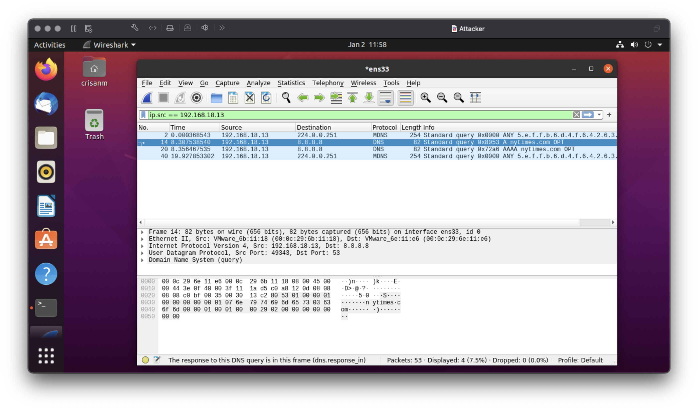

# ARP Spoofing

## Setup

The virtual machine setup consists of the following machines that are in the same network:

| Machine  | IP address      | MAC address         |
| -------- | --------------- | ------------------- |
| Router   | `192.168.18.11` | `00:0C:29:6E:11:E6` |
| Victim   | `192.168.18.12` | `00:0C:29:BB:F8:2C` |
| Attacker | `192.168.18.13` | `00:0C:29:6B:11:18` |

The *Attacker* will poison the ARP cache of both the *Victim* and *Router* machines and it will redirect traffic between them. In order for there to be traffic between the *Victim* and the *Router* with *Attacker* as the middleman, the *Attacker* has to route packets between them. Therefore we have to enable IP forwarding on the *Attacker* machine. Essentially we are trying to achieve the following state.
	

## Overview of ARP

The purpose of ARP is to map IP addresses to MAC addresses, it consists of a request and a reply:
- ARP request: machine A sends a broadcast ARP message at address `FF:FF:FF:FF:FF:FF` to get the MAC address of machine B
- ARP reply: machine B will respond to machine A with its MAC address

After the above process is done machine A will cache the MAC address of machine B for a limited amount of time, in my case the cache is stored for a default of 60 seconds.

A list of normal ARP requests and replies from the *Router*'s point of view is shown in the image below:

A normal ARP table from the *Router*'s point of view is shown in the image below:

## How ARP cache poisoning / spoofing works

Because there is no authentication in the ARP protocol, any system from the same network can reply to ARP requests. For instance, in the above example a machine C could have answered machine A pretending it is machine B. This is the security flaw that the ARP spoofing attack exploits.

A list of abnormal ARP requests and replies from the *Router*'s point of view, suggesting forged replies coming from the machine with the `00:0C:29:6B:11:18` MAC address (corresponding to the *Attacker*'s machine), is shown in the image below:

An abnormal ARP table from the *Router*'s point of view is shown in the image below, the abnormality comes from the fact that two distinct IP addresses have the same MAC address:

The *Victim* has an abnormal ARP table as well::

The *attacker* ran the following command in order to achieve what is seen in the above pictures:

    $ arpspoof -t 192.168.18.12 192.168.18.11 -r
    // arpspoof is the name of the ARP spoofing tool
    // the -t argument is used to specify the target, in this case 192.168.18.12
    // 192.168.18.11 in this case represents the host
    // -r options allows poisoning in both directions

In this case the *Attacker* (`192.168.18.13`) pretends to be the *Victim* (`192.168.18.12`) by sending unsolicited ARP replies to the *Router* (`192.168.18.11`). Because of the `-r` option the same happens in the other direction, that is the *Attacker* pretends to be the *Router* by sending unsolicited ARP replies to the *Victim*.

At this point in time, the traffic between the *Victim* and the *Router* goes through the *Attacker*. In order to prove this, we're going to do perform a DNS lookup for `nytimes.com` from the *Victim*'s machine by running the following command:

    nslookup nytimes.com

As we can see below, Wireshark caught the DNS A record query from `192.168.18.13` (*Victim*'s machine) to Google's public DNS server `8.8.8.8`.

The possible damage that can be done by the *Attacker* can be:
- package inspection - the *Attacker* can spy by inspecting the packets sent by the *Victim*
- modify the packets - the *Attacker* can change a packet's content before forwarding it
- denial of service - in case the *Attacker* does not forward the packets towards the network gateway

## Defense against ARP cache poisoning/spoofing
### Static ARP entries
This implies eliminating the dynamic element from the ARP protocol, that is the ARP query and ARP replies and instead manually setting the IP-MAC address mappings. This however does not scale well on large networks.

### Detection and prevention software
There exist software that detects multiple IP addresses that point to the same MAC address, indicating an ARP spoof attack. Other detection software would be notifying the network administrator when an ARP entry changes. Other types of software can perform ARP requests and reply validation.

### Data encryption
If the data is end-to-end encrypted, then the *Attacker* won't be able to spy on the data sent by the *Victim*.
